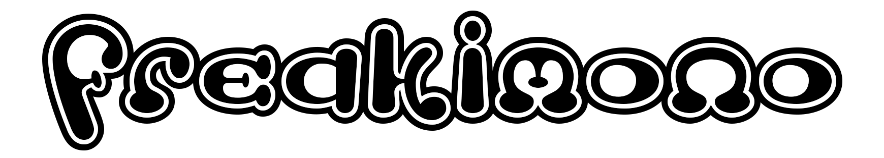

<br/>

## Table of Contents
- [Table of Contents](#table-of-contents)
- [Description](#description)
- [User Story](#user-story)
- [Acceptance Criteria](#acceptance-criteria)
- [Links](#links)
- [About Socket.io](#about-socketio)
    - [Code Snippets](#code-snippets)
- [Useful Resources](#useful-resources)
- [Authors](#authors)
  - [Nifer Kilakila](#nifer-kilakila)
  - [Angie Soto](#angie-soto)
  - [Ivy Chang](#ivy-chang)
  - [Nolan Spence](#nolan-spence)
  - [Asha Chakre](#asha-chakre)
- [Built With](#built-with)
- [License](#license)

## Description
Welcome to Freakimono!  This immersive app combines the joy of creating and caring for a loveable little creature and the fun of connecting with other users to battle it out in a dynamic battle environment.  Upon first visit, we'll guide you through the process of setting up a new account and the inception of your new adorable digital friend.  Once your new friend is created and named, you be introduced to the playpen where you can adore and care for your new pet's needs.  Lucky for you, the messes are virtual and the means to meet your little friends needs are costless!  When you are ready to take on the virtual network of other creatures, visit the battle page to duke it out with other users in a head to head memory challenge.  Fight for your life and get rewarded.

Freakimono is a NodeJS application utilizing Socket.IO and NPM express.  This enables the user to be able to interact and connect with other online users in a live and dynamic way on the battle page.  Fun digital graphics were lovingly made by our developers with the help of multiple team members artistic skills; afterwards, they were implemented not only as standard HTML images, but also as dynamically animated graphics using the Canvas API.  In order for user's pets data to persist, Sequelize ORM was utilized to interact with a JawsDB  database.  This way, we can guarantee that all user progress will stay saved on some majestic data storage somewhere out there in data-land. Freakimono is deployed live on Heroku.
  
## User Story
```md
AS A PERSON that can’t have pets, 
I WANT a game that requires regular login, 
SO THAT I can experience having a critter of my own to raise and nourish.
```

## Acceptance Criteria
```md
WHEN I visit the application page
THEN I am presented with a polished landing page where I can signin or signup
WHEN I choose to sign in, I enter my email and password and am taken to the playpen page
IF I'm not signed up
THEN I can choose to sign up and I am taken to a signup and create pet page
WHEN I am on the signup and create pet page
THEN I am prompted to enter email and password to sign up.  The create pet form appears and I am prompted to choose a pet type and name it.
WHEN I click the create pet button
THEN I am redirected to the playpen page where I can care for my pet.
WHEN I visit the playpen page
THEN I see an animated canvas with my pet and their current stats and needs
WHEN my pet has needs that have to be fullfilled
THEN I can press buttons to interact with it and update its status on the canvas animation
WHEN I want to interact with other users
THEN I click the Battle Another Creature button
WHEN I visit the battle page
THEN I am presented with a help instructional modal, cute message, dynamic display, and a start button
WHEN I press start
THEN I am able to join a battle with another online user where a sequence must be memorized and entered
WHEN the battle is completed
THEN I get rewarded for a win, or lose a heart when I lose.  After a pause, I am redirected to the playpen page
WHEN I am ready to signout
THEN I can press the signout button and session data is destroyed
```

## Links

- [Github URL](https://github.com/Team-Narwhal/My_Pet)
- [Heroku URL](https://freakimono.herokuapp.com/)

***Playpen***


***Battle***


## About Socket.io

Socket.IO was a dynamic and useful technology to work with, but also came with some challenges to overcome.  Once one basic event listener/emitter was setup, the process for passing data through events to clients became natural.  However, a considerable challenge arose when trying to connect two users in a first come first serve fashion.  Below is the code logic handling the connection of 2 users in a unique room.

#### Code Snippets
```js
  // Join users to first come, first serve two people rooms
  socket.on("joined", (data) => {
    const rooms = io.sockets.adapter.rooms;
    for (const [id, members] of rooms) {
      if (/^room/.test(id) && members.size < 2) {
        console.log(`User ${socket.id} joining room, joined room: ${id}`);
        room = id;
        socket.join(room);
        socket.to(room).emit("you-first", room);
        return;
      }
    }
    room = `room-${rooms.size}`;
    socket.join(room);
    console.log(`User: ${socket.id} joined room: ${room}`);
    });
```

First, we utilized a `joined` event that a client emits from the front end when they initialize a battle.  From there, all active rooms are stored into a const; the next challenge was the data-type of the `io.sockets.adapter.rooms`. We had to use a for/of loop because `rooms` was a `Map` of `Set` data-types; by using the for/of loop we had access to the room id and the members currently in that room.  Now a simple if statement can check if the room was created by this room builder using regex, and check if that room had less than two people.  If the conditions are met, the user will join that room.  Upon joining a `you-first` event will be emitted letting the other user begin the battle processs.

If there are no rooms available meeting those conditions, a user will simply be added to a new dynamically created room based off of the size of the rooms `Map` and will wait for a player to join.  Once an available user joins their room, they receive the `you-first` event and will start the battle process.  Next, we had to solve the problem of a user disconnecting during game play.

We learned through some trial and error/google searches about two important built in events that handle users disconnecting.  They are the `disconnecting` event and the `disconnect` event.  The important difference in the case of this project was that the `disconnecting` event still had access to the socket instance of the disconnecting user and the rooms that they are join in.  Below is a code snippet of how we could still emit an event to their joined rooms:

```js
  socket.on('disconnecting', () => {
    for (const room of socket.rooms) {
      if (room !== socket.id) {
        socket.to(room).emit('user-left');
      };
    };
  });
```

As seen above, we were able to emit a `user-left` event to the room/s that the disconnecting socket was join in.  This way, the other client paired with them in the battle wouldn't suddenly hang in the game logic if their oppenent disconnected.  The important thing to note is that in the `disconnect` event, you no longer have access to the disconnected socket instance's rooms as they are no longer connected in any rooms.  This important distinction helped us ensure that no client was left in a logic purgatory when an oppenent intentionally or accidentally disconnected or left the battle page.

 ## Useful Resources

- [Socket.IO ex. Chat App](https://socket.io/get-started/chat) - This is a great example of implementing Socket.IO for a chat app.  This was a useful resource for implementing rooms and connecting users.
- [CSS Viewport Units](https://www.sitepoint.com/css-viewport-units-quick-start/) - This blog posts provides an easy to read quick reference for using viewport units in CSS.  It was very helpful in implementing a mobile first design style.
- [MDN HTML Canvas Game Tutorial](https://developer.mozilla.org/en-US/docs/Games/Tutorials/2D_Breakout_game_pure_JavaScript) - If you need a quick and effective intro for using an HTML canvas in a javascript game, this MDN tutorial is for you.  Teaches the basics and provides a great foundation quickly.
  
- [Stack Overflow](https://stackoverflow.com/questions/10214873/make-canvas-as-wide-and-as-high-as-parent)

- [W3Schools](https://www.w3schools.com/cssref/pr_background-attachment.asp)

- [Bootstrap](https://getbootstrap.com/docs/5.2/getting-started/introduction/)

- [NES-style CSS Framework](https://nostalgic-css.github.io/NES.css/)

## Authors

### Nifer Kilakila
- GitHub - [NaNifer](https://github.com/NaNifer)
- Portfolio - [Nifer Kilakila](https://nanifer.github.io/Nifer-Kilakila-Portfolio-h2/)
### Angie Soto
- Website - [Angie Soto](https://anakela.github.io/homework2)
- Github - [anakela](https://github.com/anakela)
### Ivy Chang
- Website - [Ivy Chang](https://howl-lab.github.io/Portfolio/)
- Github - [howl-lab](https://github.com/howl-lab)
### Nolan Spence
- Website - [Nolan Spence](https://unicorn-barf.github.io/Portfolio_Website_HTML_CSS/)
- Github - [Unicorn-Barf](https://github.com/Unicorn-Barf)
### Asha Chakre
- Website - [Asha Chakre](https://github.com/ashachakre0906/Professional-Portfolio)
- Github - [ashachakre0906](https://github.com/ashachakre0906)

  
## Built With
<p align ="center">
    
    
    
    
    
    
    
    
    
    
    
    
</p>

## License
MIT License
Copyright (c) [2022] [Angie Soto](https://github.com/anakela), [Asha Chakre](https://github.com/ashachakre0906), [Ivy Chang](https://github.com/howl-lab), [Nifer Kilakila](https://github.com/NaNifer), [Nolan Spence](https://github.com/Unicorn-Barf)

Permission is hereby granted, free of charge, to any person obtaining a copy
of this software and associated documentation files (the "Software"), to deal
in the Software without restriction, including without limitation the rights
to use, copy, modify, merge, publish, distribute, sublicense, and/or sell
copies of the Software, and to permit persons to whom the Software is
furnished to do so, subject to the following conditions:
The above copyright notice and this permission notice shall be included in all
copies or substantial portions of the Software.
THE SOFTWARE IS PROVIDED "AS IS", WITHOUT WARRANTY OF ANY KIND, EXPRESS OR
IMPLIED, INCLUDING BUT NOT LIMITED TO THE WARRANTIES OF MERCHANTABILITY,
FITNESS FOR A PARTICULAR PURPOSE AND NONINFRINGEMENT. IN NO EVENT SHALL THE
AUTHORS OR COPYRIGHT HOLDERS BE LIABLE FOR ANY CLAIM, DAMAGES OR OTHER
LIABILITY, WHETHER IN AN ACTION OF CONTRACT, TORT OR OTHERWISE, ARISING FROM,
OUT OF OR IN CONNECTION WITH THE SOFTWARE OR THE USE OR OTHER DEALINGS IN THE
SOFTWARE.
